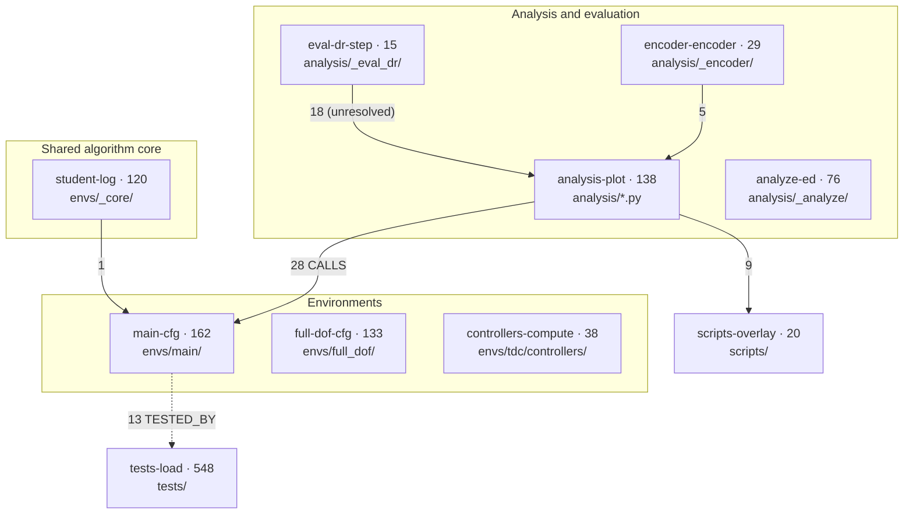

# Code-Graph Architecture Map

Graph-derived module map of `constrained-albc`: which files cluster together, how the
clusters call each other, and which execution paths carry the most weight. Produced from
the [code-review-graph](https://github.com/tirth8205/code-review-graph) (CRG) index, not
by hand.

This page complements [`../architecture.md`](../architecture.md), which describes the
*intended* structure (three-layer install stack, package layout, registered task IDs).
This one describes the *measured* structure — what the call graph actually shows. Read
`architecture.md` first for intent; read this for coupling and blast radius.

## Snapshot provenance

| Field | Value |
|---|---|
| Captured | 2026-08-21 |
| Branch | `exp/koopman-marine-obs` |
| Commit | `1566bc8b37fffe93c8c700b41413b39bf254c1cf` |
| Index freshness | `head_matches_build: true` at capture |
| Scale | 1,476 nodes, 14,851 edges, 191 files, 10 communities |
| Risk score | low (0.40), 4 test gaps |

This is a **snapshot of an experiment branch**, not of `main`. Community sizes and
coupling counts move with the code; re-run the regeneration below rather than trusting
the numbers after a refactor.

### Regenerating

```bash
# rebuild the index (full build, not update, after any rename/delete/branch switch)
cd /workspace/constrained-albc && code-review-graph build

# then query via MCP, always passing repo_root explicitly
#   get_minimal_context_tool(task="map architecture", repo_root="/workspace/constrained-albc")
#   get_architecture_overview_tool(detail_level="minimal", repo_root=...)
#   list_flows_tool(detail_level="minimal", repo_root=...)
```

`repo_root` is mandatory. `/workspace` is a thin meta-repo with no source of its own, and
a query without `repo_root` fabricates an empty graph at the working directory and
answers `ok` with zero results — indistinguishable from a genuine "not found". The three
real graphs are registered in `~/.code-review-graph/registry.json` under the aliases
`albc`, `isaaclab`, `marinelab`.

## Module map



Edge labels are the cross-community edge counts CRG reports. The `TESTED_BY` and
`unresolved` annotations correct the tool's own summary — see
[Coupling findings](#coupling-findings).

## Communities

Louvain clusters, largest first. The `name` column is auto-derived from member symbols
and is **not always descriptive** — read the "actually is" column, which was resolved by
querying node-to-file distribution directly from `graph.db`.

| Community | Size | Cohesion | Actually is | Densest files |
|---|---:|---:|---|---|
| `tests-load` | 548 | 0.142 | The whole `tests/` tree | `test_paths.py` (52), `test_tdc_controller.py` (35), `test_student_extra_obs.py` (32), `test_constraints.py` (27) |
| `main-cfg` | 162 | 0.156 | `envs/main/` — the default task | `albc_env.py` (60), `mdp/events.py` (24), `mdp/constraints.py` (18), `mdp/rewards.py` (14) |
| `analysis-plot` | 138 | 0.116 | `analysis/` top level | `eval.py` (28), `eval_plots.py` (27), `paths.py` (27), `common.py` (13) |
| `full-dof-cfg` | 133 | 0.174 | `envs/full_dof/` — legacy variant | `albc_env.py` (56), `mdp/events.py` (22), `mdp/constraints.py` (16), `mdp/rewards.py` (14) |
| `student-log` | 120 | 0.177 | **`envs/_core/`** — the shared algorithm core, not student logging | `algorithms/constraint_trpo.py` (21), `encoder/_policy_base.py` (12), `runners/constraint_encoder_runner.py` (12), `student/models.py` (11) |
| `analyze-ed` | 76 | 0.089 | `analysis/_analyze/` post-hoc tooling | `eval_dr.py` (16), `recompute_plots.py` (13), `failure_dr.py` (10), `switching.py` (7) |
| `controllers-compute` | 38 | 0.256 | `envs/tdc/controllers/` | `tdc.py` (21), `kinematics.py` (7), `tdc_env.py` (5), `thruster_pd.py` (4) |
| `encoder-encoder` | 29 | 0.057 | `analysis/_encoder/` | `debug.py` (8), `train.py` (8), `sweep.py` (7), `_shared.py` (4) |
| `scripts-overlay` | 20 | 0.072 | `scripts/` entry points | `isaac_p1_replay.py` (4), `train_student.py` (4), `_common.py` (3), `play.py` (3) |
| `eval-dr-step` | 15 | 0.030 | `analysis/_eval_dr/` sim-free metrics | `metrics.py` (10), `dr_snapshot.py` (4), `trajectory.py` (1) |

Community membership sums to 1,279 of 1,476 nodes; the remaining 197 carry no community
assignment and are invisible to any community-level query.

The clustering independently reproduces the package layout declared in the workspace
`CLAUDE.md` section 3 — `main` / `full_dof` / `tdc` / `_core` / `analysis` sub-packages
each land in their own community. The one place the measured structure disagrees with the
declared one is the `student-log` label, which covers `_core/` rather than anything
student-specific.

## Execution flows

Entry points ranked by CRG's criticality score, with the source location of each entry.

| Flow | Criticality | Nodes | Files | Depth | Entry point |
|---|---:|---:|---:|---:|---|
| `run_static` | 0.688 | 66 | 13 | 4 | `constrained_albc/analysis/eval.py:1161` |
| `run_segmented` | 0.676 | 38 | 11 | 3 | `constrained_albc/analysis/eval.py:2355` |
| `run_periodic` | 0.674 | 24 | 9 | 3 | `constrained_albc/analysis/eval.py:1961` |
| `cmd_debug` | 0.540 | 18 | 3 | 4 | `constrained_albc/analysis/_encoder/debug.py:223` |
| `cmd_plot` | 0.540 | 12 | 3 | 4 | `constrained_albc/analysis/monitor.py:152` |
| `cmd_compare` | 0.540 | 11 | 3 | 4 | `constrained_albc/analysis/monitor.py:301` |
| `main` | 0.455 | 17 | 2 | 3 | `scripts/train_student.py:232` |
| `main` | 0.455 | 12 | 2 | 3 | `scripts/train.py:162` |

The top three are the three `eval.py` DR modes, and `run_static` — the required mode for
`Isaac-ConstrainedALBC-TRPO-v0` — is both the most critical and the widest, touching 13
files at depth 4. Training entry points score lower because they delegate almost
immediately into stock RSL-RL, which the graph does not index.

## Coupling findings

CRG emits three high-coupling warnings. Two resolve to concrete edges; one does not.

### 1. `analysis-plot` -> `main-cfg`, 28 CALLS (real)

The evaluation harness reaches directly into the default env's internals:

| Target | Edges | Callers |
|---|---:|---|
| `envs/main/mdp/events.py::get` | 19 | `eval.py::run_static` (11), `run_periodic` (4), `run_segmented` (4) |
| `envs/main/config.py::DomainRandomizationCfg` | 8 | `analysis/dr_config.py` (6), `eval.py::_plot_dr_distributions` (1), `run_periodic` (1) |
| `envs/main/mdp/events.py::_get_hydro_base` | 1 | `eval.py::_read_per_env_dr` |

This is genuine architectural coupling, not an artifact: eval-side DR reconstruction
imports the env's own DR config class and reads env event state to snapshot per-env
randomization. Any change to `DomainRandomizationCfg` fields or to the `events.py`
getters has direct blast radius into all three eval modes. Note that `_get_hydro_base`
is reached through a private name, so a rename there breaks eval silently.

### 2. `main-cfg` -> `tests-load`, 13 edges (test coverage, not a dependency)

All 13 edges are `TESTED_BY`, not `CALLS` — the architecture overview's `top_kinds`
field reports `["CALLS"]` for this pair, which is wrong. These are coverage links from
three env symbols to their tests:

- `albc_env.py::_draw_control_delay` -> 5 tests in `test_action_smoothness_commanded.py`, `test_latency_dr_env.py`
- `albc_env.py::_apply_control_delay` -> 4 tests in the same two files
- `config.py::DomainRandomizationCfg` -> 4 tests in `test_dr_config.py`, `test_priv_obs_bounds.py`

There is no reverse dependency from production config into test code. Do not read this
warning as an architecture defect.

### 3. `eval-dr-step` -> `analysis-plot`, 18 edges (unverified)

This one does not reconcile against the node-level `edges` table. Community 15's nodes
emit 400 outgoing edges, of which 387 target symbols that are not graph nodes (numpy and
stdlib calls) and 13 stay inside community 15. Zero resolve into community 16.

Treat cross-community edge counts in the overview as directional hints, not exact
measurements. When a warning matters, resolve it to concrete edges before acting on it.

## Caveats for anyone querying this graph

- **Always pass `repo_root`.** A bare query in `/workspace` builds and answers from an
  empty graph without erroring. The root graphs were purged 2026-08-21 precisely because
  the meta-repo tracks glue files and no source; do not re-create one there.
- **`update` does not forget.** After a rename, deletion, or branch switch, run
  `code-review-graph build`, not `update` — incremental update never revisits a file that
  was moved away, so its nodes persist and the graph answers confidently from a tree that
  no longer exists.
- **Community names are auto-derived.** `student-log` is `_core/`. Never key anything to
  a Louvain community id or its generated label; both are re-minted on re-clustering.
- **`tests-load` is 37% of the graph.** Any statistic computed over "all nodes" is
  dominated by test code. Filter on `is_test` before drawing conclusions about
  production structure.
- **Config files produce no nodes.** YAML/TOML tuning changes have an empty blast radius
  in the graph, which is indistinguishable from "no impact". Compare sibling configs with
  grep instead.
- **`max_depth=1` for impact radius.** The default of 2 follows the other out-edges of
  each importer and reports unrelated siblings as affected.

Full rule set: `/workspace/.claude/rules/05-code-graphs.md`. Evaluation-mode rules that
the flow table refers to: `/workspace/.claude/rules/03-analysis-quality.md`.
